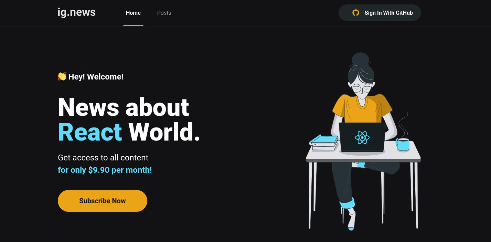

  
    

<h1 align="center">ig.news app</h1>

## 💻 About Project

Ignews is a Subscription Platform App created with NextJS, using SSR and SSG for securely fetch API's, NextAuth (Social OAuth), FaunaDB Paypal and Prismic CMS.

- Login with your GitHub account.
- Subscribe with Stripe (test account, **please use the fake card numbers**: 4242 4242 4242 4242, a valid future date, such as 12/34 and any three-digit CVC)
- See posts only if you're subscribed.
- If you don't you only able to see an excerpt.

## 🔧 Technologies used

- [NextJS](https://nextjs.org/)
- [TypeScript](https://www.typescriptlang.org/)
- [Stripe](https://stripe.com/docs)
- [Pricmic CMS](https://prismic.io/)
- [FaunaDB](https://fauna.com/)
- [Next-Auth](https://next-auth.js.org/)
- [Axios](https://axios-http.com/)

### See live [here](https://ignews-andradept.vercel.app/).

---

## 📝 License

This project is under [MIT License](./LICENSE).

## 👽 Author

Made by [Eduardo Andrade](https://andradept.com/) 🤘
